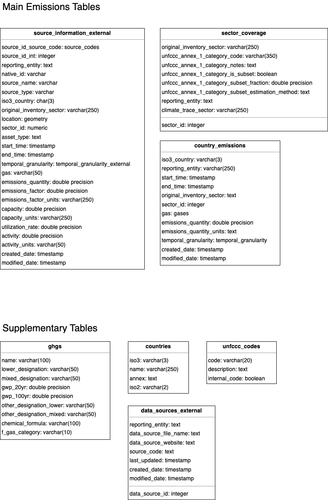

# Climate TRACE Data Schema 

## Summary 
- Climate TRACE currently stores external emissions information for individual *sources* and for *countries* in separate tables.
- Supplementary tables contain data that support analysis and use of the data.
- For every external data source that Climate TRACE imports, we assign an IPCC/UNFCCC emissions code to the sector that is being reported. This information, stored in sector_coverage is used heavily for the tools detailed in the /compare section of this repository.

## Diagram 

## Descriptions 
`source_information_external` 

- `asset_id_source_code` : a lowercase abbreviation of the external data sources. The source code exists only for sources of asset level data. This links to the data_sources_external table.
- `asset_id_int`: an auto-generating integer associated with the asset. Assets across data sources might have the same asset_id_int, which is why the primary key is a combination of
- `reporting_entity` : The full name of the entity who is reporting these emissions (e.g. unfccc_annex_1, faostat, edgar, etc.)
- `native_id` : If the data source has IDs for the asset, this field stores those native ids from the original data source.
- `source_name` : Name of the asset as reported by external data source.
- `source_type` : Type of source, can be: asset, city, country, company, gadm0, gadm1, gadm2
- `iso3_country` : 3 Letter ISO code for the country where the asset is located.
- `original_inventory_sector` : This is the name of the sector *as it appears* in the original inventory. A crosswalk between these sectors and their IPCC/UNFCCC codes is available in *`sector_coverage` .*
- `location` : geometry object containing location information for the asset.
- `sector_id` :Numerical id from sector_coverage table that links the two tables. It is also possible to join directly on original_inventory_sector.
- `asset_type` : Any information we are able to gather about the asset_type. (e.g. for a mining sector this might be ‘Surface’ or ‘Underground’)
- `start_time` : The start time for the when the estimate is valid. If the inventory is annual, this will be January 1st of the year for which the data is reported. (e.g. for 2017 data, this will be 01-01-2017.
- `end_time` : The end time for when the estimate is valid. If the inventory is annual, this will be December 21st for the year for which the data is reported (.e.g. for 2017 data, this will be 12-31-2017.
- `temporal_granularity` : Indicates the temporal granularity of the data. An enum value with the following options: `('month', 'day', 'hour', 'week', 'annual', 'other')`
- `gas` : The gas that is being reported. This is an enum value that is created from the lower_designation column of the *`ghgs` table.*
- `emissions_quantity` : Numerical value indicating the emissions quantity reported for this gas, sector, country, year. All values must be converted to metric tonnes.
- `emissions_factor` : If the data source provides an emissions factor (emissions per unit produced), it is stored in this column
- `emissions_factor_units` : The units of the stored emissions factor.
- `capacity` : If the data source provides a capacity for the asset, it is stored in this column .
- `capacity_units` : Units for the capacity stored in capacity column.
- `utilization_rate` : The utilization rate of the asset (i.e. for electricity, this is the capacity factor). This should be a number between 0 and 1.
- `activity` : If the data source provides an activity value, it is stored in this column.
- `activity_units` : Units for the activity value stored in activity column.
- `created_date` : The date the record was created.
- `modified_date` : The data a record was modified.

`country_emissions`

- This table stores country level estimates from various external country inventories.
- `iso3_country:`The ISO 3 letter code is used to identify countries, a crosswalk between the 3 letter code, 2 letter code, and country name is available in the *countries* table.
- `reporting_entity`: The name of the entity who is reporting these emissions (e.g. unfccc_annex_1, faostat, edgar, etc.)
- `start_time` : The start time for the when the estimate is valid. If the inventory is annual, this will be January 1st of the year for which the data is reported. (e.g. for 2017 data, this will be 01-01-2017.
- `end_time` : The end time for when the estimate is valid. If the inventory is annual, this will be December 21st for the year for which the data is reported (.e.g. for 2017 data, this will be 12-31-2017.
- `original_inventory_sector` : This is the name of the sector *as it appears* in the original inventory. A crosswalk between these sectors and their IPCC/UNFCCC codes is available in *`sector_coverage` .*
- `sector_id` : Numerical id from sector_coverage table that links the two tables. It is also possible to join directly on original_inventory_sector.
- `gas` : The gas that is being reported. This is an enum value that is created from the lower_designation column of the *`ghgs` table.*
- `emissions_quantity` : Numerical value indicating the emissions quantity reported for this gas, sector, country, year. All values must be converted to metric tonnes.
- `emissions_quantity_units` : Always ‘tonnes’.
- `temporal_granularity` : Indicates the temporal granularity of the data. An enum value with the following options: `('month', 'day', 'hour', 'week', 'annual', 'other')`
- `created_date` : The date the record was created.
- `modified_date` : The data a record was modified.

`sector_coverage` 

- `sector_id` : Numerical id for the sector.
- `original_inventory_sector` : Name of the sector as originally reported in the source dataset.
- `unfccc_annex_1_category_code` : The code, or list of UNFCCC codes that describe the emissions covered in the sector. These are manually researched and determined.
- `unfccc_annex_1_category_code_notes` : Any notes to be made about the UNFCCC code assignment that would help with interpretation (e.g. ‘The international shipping emissions are included in the ROW in the industry sector. Industries included different for China’)
- `unfccc_annex_1_category_is_subset` : UNFCCC codes are highly granular and most often, a reported sector is covering multiple of the most granular UNFCCC sectors. However, occasionally a reported sector is only covering part of a UNFCCC sector. If this is true, this boolean is set to True. (e.g. copper-mining, bauxite-mining, iron-mining are all Climate TRACE sectors that are subsets of 1.A.2.g.iii.)
- `unfccc_annex_1_category_subset_fraction` : Float indicating the estimated fraction of the UNFCCC code that this sector covers.
- `unfccc_annex_1_category_estimation_method` : Text describing the method used to estimate the fraction.
- `reporting_entity` : The name of the entity who is reporting these emissions (e.g. unfccc_annex_1, faostat, edgar, etc.)
- `climate_trace_sector` : For sectors that Climate TRACE collects *asset* information for, this column is used to tag which Climate TRACE sector the asset falls into. For example, a CAFO collected from an external source would be tagged to *enteric-fermentation-cattle-feedlot, manure-management-cattle-feedlot.*

### Supplementary Tables

`data_sources_external` 

- `reporting_entity` : The name of the entity who is reporting these emissions (e.g. unfccc_annex_1, faostat, edgar, etc.)

`ghgs` 

- `name` : Written name for the greenhouse gas (e.g. methane, sulphur hexafluoride, etc.)
- `lower_designation` : The lowercase abbreviation for the gas (e.g. ch4, sf6, co2, etc.)
- `mixed_designation` : The properly formatted abbreviation for the gas, upper and lowercase letters included (e.g. HFC-152a, c-C3F6).
- `gwp_20yr` : The 20 year global warming potential (GWP) for the gas from AR6.
- `gwp_100yr` : The 100 year GWP for the gas from AR6.
- `other_designation_lower` : If the gas has another name. (e.g. hexafluoroethane’s lower designation is c2f6, but also goes by pfc-116).
- `chemical_formula` : The chemical formula for the gas, if different from its name.
- `f_gas_category` : Only used for f-gases. The options are: PFC, HFC, HCFC.

`countries` 

- `iso3` : The 3 letter ISO code for a country
- `name` : The full name of the country
- `annex` : either ‘nonannex1’ or ‘annex1’ according to the UNFCCC guidelines.
- `iso2` : The 2 letter ISO code for a country

`unfccc_codes` 

- `code` : Only the code part of the UNFCCC sectors. (e.g. for 1.A.1 Energy Industries, this value is just ‘1.A.1’. These codes can link to the unfccc_annex_1_category_code column of the sector_coverage table.
- `description` : The text of the UNFCCC sectors. (e.g. for 1.A.1 Energy Industries, this value is just ‘Energy Industries’)n
- `internal_code` : Boolean, TRUE or FALSE. Some UNFCCC sectors do not have codes associated with them. For example, though International Bunkers (which include International Aviation and International Navigation) is included in the UNFCCC reporting structure, there are no codes. For these sectors, Climate TRACE has assigned a reasonable code in order to use them in the sector_coverage table for describing external sectors. For the International Bunkers, we assigned the code ‘7’. Since International Aviation and International Navigation are subsectors within this, they have been assigned ‘7.A’ and ‘7.B’ respectively.